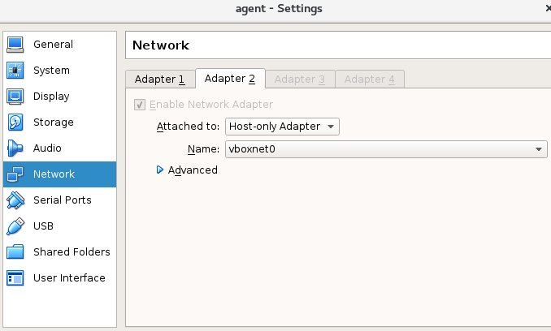
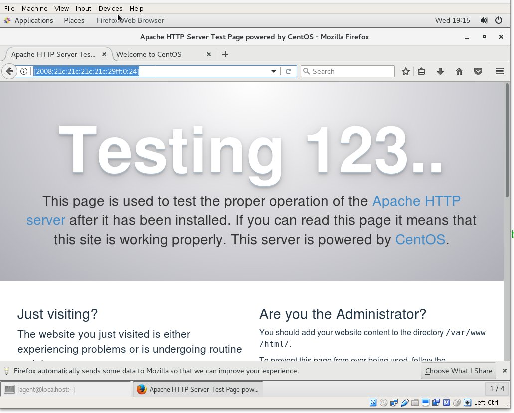

#### 背景介绍

  最近因为需要将我们的服务都支持ipv6， 所以尝试在virtualbox中来验证。 这里我们以httpd服务为例，  
要求可以在virtualbox的宿主机上可以访问virtualbox中虚拟机提供的服务


#### 环境介绍
 我们的虚拟机配置了两块网卡

 * eth0: NAT 模式

    
 * eth1： host-only 模式

    

  启动虚拟机， 查看对应的ip信息

  ```
  [root@localhost ~]# ip a
  1: lo: <LOOPBACK,UP,LOWER_UP> mtu 65536 qdisc noqueue state UNKNOWN qlen 1
      link/loopback 00:00:00:00:00:00 brd 00:00:00:00:00:00
      inet 127.0.0.1/8 scope host lo
         valid_lft forever preferred_lft forever
      inet6 ::1/128 scope host
         valid_lft forever preferred_lft forever
  2: enp0s3: <BROADCAST,MULTICAST,UP,LOWER_UP> mtu 1500 qdisc pfifo_fast state UP qlen 1000
      link/ether 08:00:27:f8:26:a0 brd ff:ff:ff:ff:ff:ff
      inet 10.0.2.15/24 brd 10.0.2.255 scope global dynamic enp0s3
         valid_lft 85253sec preferred_lft 85253sec
      inet6 fe80::a00:27ff:fef8:26a0/64 scope link
         valid_lft forever preferred_lft forever
  3: enp0s8: <BROADCAST,MULTICAST,UP,LOWER_UP> mtu 1500 qdisc pfifo_fast state UP qlen 1000
      link/ether 08:00:27:51:05:75 brd ff:ff:ff:ff:ff:ff
      inet 192.168.11.10/24 brd 192.168.11.255 scope global dynamic enp0s8
         valid_lft 53sec preferred_lft 53sec
      inet6 fe80::a00:27ff:fe51:575/64 scope link
         valid_lft forever preferred_lft forever
  4: virbr0: <NO-CARRIER,BROADCAST,MULTICAST,UP> mtu 1500 qdisc noqueue state DOWN qlen 1000
      link/ether 52:54:00:09:36:92 brd ff:ff:ff:ff:ff:ff
      inet 192.168.122.1/24 brd 192.168.122.255 scope global virbr0
         valid_lft forever preferred_lft forever
  5: virbr0-nic: <BROADCAST,MULTICAST> mtu 1500 qdisc pfifo_fast master virbr0 state DOWN qlen 1000
      link/ether 52:54:00:09:36:92 brd ff:ff:ff:ff:ff:ff
  ```


* 第一步， 首先给我们的host-only的网络设备*enp0s8*添加一个ipv6的地址

  ```
  #filename: /etc/sysconfig/network-scripts/ifcfg-enp0s8

  HWADDR=08:00:27:51:05:75
  TYPE=Ethernet
  BOOTPROTO=dhcp
  DEFROUTE=yes
  PEERDNS=yes
  PEERROUTES=yes
  IPV4_FAILURE_FATAL=no
  IPV6INIT=yes
  IPV6_AUTOCONF=yes
  IPV6_DEFROUTE=yes
  IPV6_PEERDNS=yes
  IPV6_PEERROUTES=yes
  IPV6_FAILURE_FATAL=no
  IPV6ADDR=2008:21c:21c:21c:21c:29ff::24
  NAME=enp0s8
  UUID=3e37c82b-6fe5-417f-be3c-5e3f78aa1677
  ONBOOT=yes

  ```

  重启网络服务

  ```
  [root@localhost ~]# service network restart
  Restarting network (via systemctl):                        [  OK  ]

  [root@localhost ~]# ifconfig enp0s8
  enp0s8: flags=4163<UP,BROADCAST,RUNNING,MULTICAST>  mtu 1500
          inet 192.168.11.10  netmask 255.255.255.0  broadcast 192.168.11.255
          inet6 2008:21c:21c:21c:21c:29ff:0:24  prefixlen 64  scopeid 0x0<global>
          inet6 fe80::a00:27ff:fe51:575  prefixlen 64  scopeid 0x20<link>
          ether 08:00:27:51:05:75  txqueuelen 1000  (Ethernet)
          RX packets 1959  bytes 183869 (179.5 KiB)
          RX errors 0  dropped 0  overruns 0  frame 0
          TX packets 1233  bytes 232147 (226.7 KiB)
          TX errors 0  dropped 0 overruns 0  carrier 0  collisions 0
  ```

* 编辑httpd.conf配置文件， 跟我们的ipv6地址绑定

  ```
  [root@localhost ~]# cat /etc/httpd/conf/httpd.conf  | grep -v "^#" | grep -v "^$" | grep -v "\s#"
  ServerRoot "/etc/httpd"
  Listen [2008:21c:21c:21c:21c:29ff:0:24]:80           # 改这里
  Include conf.modules.d/*.conf
  User apache
  	Group apache
  ServerAdmin root@localhost
  <Directory />
      AllowOverride none
      Require all denied
  </Directory>
  DocumentRoot "/var/www/html"
  <Directory "/var/www">
      AllowOverride None
      Require all granted
  </Directory>
  <Directory "/var/www/html">
      Options Indexes FollowSymLinks
      AllowOverride None
      Require all granted
  </Directory>
  <IfModule dir_module>
      DirectoryIndex index.html
  </IfModule>
  <Files ".ht*">
      Require all denied
  </Files>
  ErrorLog "logs/error_log"
  LogLevel warn
  <IfModule log_config_module>
      LogFormat "%h %l %u %t \"%r\" %>s %b \"%{Referer}i\" \"%{User-Agent}i\"" combined
      LogFormat "%h %l %u %t \"%r\" %>s %b" common
      <IfModule logio_module>
        LogFormat "%h %l %u %t \"%r\" %>s %b \"%{Referer}i\" \"%{User-Agent}i\" %I %O" combinedio
      </IfModule>
      CustomLog "logs/access_log" combined
  </IfModule>
  <IfModule alias_module>
      ScriptAlias /cgi-bin/ "/var/www/cgi-bin/"
  </IfModule>
  <Directory "/var/www/cgi-bin">
      AllowOverride None
      Options None
      Require all granted
  </Directory>
  <IfModule mime_module>
      TypesConfig /etc/mime.types
      AddType application/x-compress .Z
      AddType application/x-gzip .gz .tgz
      AddType text/html .shtml
      AddOutputFilter INCLUDES .shtml
  </IfModule>
  AddDefaultCharset UTF-8
  <IfModule mime_magic_module>
      MIMEMagicFile conf/magic
  </IfModule>
  EnableSendfile on
  IncludeOptional conf.d/*.conf

  ```

  重启httpd服务

  ```
  [root@localhost ~]# service httpd restart
  Redirecting to /bin/systemctl restart httpd.service

  [root@localhost ~]# netstat -anp | grep :80 | grep LISTEN
  tcp6       0      0 2008:21c:21c:21c:21c:80 :::*                    LISTEN      4015/httpd          
  [root@localhost ~]#
  ```

*  在虚拟机中检验ipv6是否配置成功

  在**虚拟机**中， 用浏览器访问 **http://[2008:21c:21c:21c:21c:29ff:0:24]**, 看是否可以访问,经测试， 可以成功访问

  

* 在宿主机访问 **http://[2008:21c:21c:21c:21c:29ff:0:24]**， 看看是否可以访问, 经测试， 不可以

* 关闭虚拟机防火墙，再试

  ```
  [root@localhost ~]# iptables -F
  [root@localhost ~]# iptables -X
  [root@localhost ~]# ip6tables -F
  [root@localhost ~]# ip6tables -X
  ```
 结果还是不可以

* 看一下宿主即的ip， 以及路由表

  ```
  [lee@lee ~]$ ip a
  1: lo: <LOOPBACK,UP,LOWER_UP> mtu 65536 qdisc noqueue state UNKNOWN qlen 1
      link/loopback 00:00:00:00:00:00 brd 00:00:00:00:00:00
      inet 127.0.0.1/8 scope host lo
         valid_lft forever preferred_lft forever
      inet6 ::1/128 scope host
         valid_lft forever preferred_lft forever
  2: eno1: <BROADCAST,MULTICAST,UP,LOWER_UP> mtu 1500 qdisc pfifo_fast state UP qlen 1000
      link/ether 4c:cc:6a:a3:86:02 brd ff:ff:ff:ff:ff:ff
      inet 10.100.203.214/24 brd 10.100.203.255 scope global dynamic eno1
         valid_lft 250302sec preferred_lft 250302sec
      inet6 2008:26c:27c:28c:29c:29ff:0:26/64 scope global
         valid_lft forever preferred_lft forever
      inet6 fe80::4ecc:6aff:fea3:8602/64 scope link
         valid_lft forever preferred_lft forever
  3: virbr0: <NO-CARRIER,BROADCAST,MULTICAST,UP> mtu 1500 qdisc noqueue state DOWN qlen 1000
      link/ether 52:54:00:05:a8:64 brd ff:ff:ff:ff:ff:ff
      inet 192.168.122.1/24 brd 192.168.122.255 scope global virbr0
         valid_lft forever preferred_lft forever
  4: virbr0-nic: <BROADCAST,MULTICAST> mtu 1500 qdisc pfifo_fast master virbr0 state DOWN qlen 1000
      link/ether 52:54:00:05:a8:64 brd ff:ff:ff:ff:ff:ff
  5: vboxnet0: <BROADCAST,MULTICAST,UP,LOWER_UP> mtu 1500 qdisc pfifo_fast state UP qlen 1000
      link/ether 0a:00:27:00:00:00 brd ff:ff:ff:ff:ff:ff
      inet 192.168.11.1/24 brd 192.168.11.255 scope global vboxnet0
         valid_lft forever preferred_lft forever
      inet6 fe80::800:27ff:fe00:0/64 scope link
         valid_lft forever preferred_lft forever
  6: vboxnet1: <BROADCAST,MULTICAST> mtu 1500 qdisc noop state DOWN qlen 1000
      link/ether 0a:00:27:00:00:01 brd ff:ff:ff:ff:ff:ff
  [lee@lee ~]$
  [lee@lee ~]$
  [lee@lee ~]$
  [lee@lee ~]$ route -6 -n
  Kernel IPv6 routing table
  Destination                    Next Hop                   Flag Met Ref Use If
  ::/96                          ::                         !n   1024 0     0 lo
  0.0.0.0/96                     ::                         !n   1024 0     0 lo
  2002:a00::/24                  ::                         !n   1024 0     0 lo
  2002:7f00::/24                 ::                         !n   1024 0     0 lo
  2002:a9fe::/32                 ::                         !n   1024 0     0 lo
  2002:ac10::/28                 ::                         !n   1024 0     0 lo
  2002:c0a8::/32                 ::                         !n   1024 0     0 lo
  2002:e000::/19                 ::                         !n   1024 0     0 lo
  2008:26c:27c:28c::/64          ::                         U    256 5    16 eno1
  3ffe:ffff::/32                 ::                         !n   1024 0     0 lo
  fe80::/64                      ::                         U    256 0     0 eno1
  fe80::/64                      ::                         U    256 0     0 vboxnet0
  ::/0                           ::                         !n   -1  1   885 lo
  ::1/128                        ::                         Un   0   7    43 lo
  2008:26c:27c:28c:29c:29ff:0:26/128 ::                         Un   0   8    29 lo
  fe80::800:27ff:fe00:0/128      ::                         Un   0   1     0 lo
  fe80::4ecc:6aff:fea3:8602/128  ::                         Un   0   8    27 lo
  ff00::/8                       ::                         U    256 6  1996 eno1
  ff00::/8                       ::                         U    256 8    70 vboxnet0
  ::/0                           ::                         !n   -1  1   885 lo
  ```

通过路由表我们看到访问*2008:21c:21c:21c:21c:29ff:0:24*这个ip， 需要走默认的lo interface， 这个显然不符合我们的要求， 那么我们现在改一下，我们希望通过*vboxnet0*这个host-only网络设备来访问

1. 首先， 在宿主机上， **给vboxnet0 添加一个ipv6的ip**

  ```
  [root@lee lee]# vboxmanage help hostonlyif
  Oracle VM VirtualBox Command Line Management Interface Version 5.1.14
  (C) 2005-2017 Oracle Corporation
  All rights reserved.
  Usage:
  VBoxManage hostonlyif       ipconfig <name>
                              [--dhcp |
                              --ip<ipv4> [--netmask<ipv4> (def: 255.255.255.0)] |
                              --ipv6<ipv6> [--netmasklengthv6<length> (def: 64)]]
                              create |
                              remove <name>

  [root@lee lee]# ifconfig vboxnet0
  vboxnet0: flags=4163<UP,BROADCAST,RUNNING,MULTICAST>  mtu 1500
        inet 192.168.11.1  netmask 255.255.255.0  broadcast 192.168.11.255
        inet6 2008:21c:21c:21c:21c:29ff:0:25  prefixlen 64  scopeid 0x0<global>
        inet6 fe80::800:27ff:fe00:0  prefixlen 64  scopeid 0x20<link>
        ether 0a:00:27:00:00:00  txqueuelen 1000  (Ethernet)
        RX packets 0  bytes 0 (0.0 B)
        RX errors 0  dropped 0  overruns 0  frame 0
        TX packets 655  bytes 122614 (119.7 KiB)
        TX errors 0  dropped 0 overruns 0  carrier 0  collisions 0
```

2. 查看一下宿主机现在的路由规则，

  ```
  [root@lee lee]# route -6 -n
  Kernel IPv6 routing table
  Destination                    Next Hop                   Flag Met Ref Use If
  ::/96                          ::                         !n   1024 0     0 lo
  0.0.0.0/96                     ::                         !n   1024 0     0 lo
  2002:a00::/24                  ::                         !n   1024 0     0 lo
  2002:7f00::/24                 ::                         !n   1024 0     0 lo
  2002:a9fe::/32                 ::                         !n   1024 0     0 lo
  2002:ac10::/28                 ::                         !n   1024 0     0 lo
  2002:c0a8::/32                 ::                         !n   1024 0     0 lo
  2002:e000::/19                 ::                         !n   1024 0     0 lo
  2008:21c:21c:21c::/64          ::                         U    256 1     2 vboxnet0   # 有了这条路由规则，我们就可以访问虚拟机内的服务了
  2008:26c:27c:28c::/64          ::                         U    256 5    16 eno1
  3ffe:ffff::/32                 ::                         !n   1024 0     0 lo
  fe80::/64                      ::                         U    256 0     0 eno1
  fe80::/64                      ::                         U    256 0     0 vboxnet0
  ::/0                           ::                         !n   -1  1   925 lo
  ::1/128                        ::                         Un   0   7    50 lo
  2008:21c:21c:21c:21c:29ff:0:25/128 ::                         Un   0   3     5 lo
  2008:26c:27c:28c:29c:29ff:0:26/128 ::                         Un   0   8    29 lo
  fe80::800:27ff:fe00:0/128      ::                         Un   0   4     6 lo
  fe80::4ecc:6aff:fea3:8602/128  ::                         Un   0   8    27 lo
  ff00::/8                       ::                         U    256 6  2015 eno1
  ff00::/8                       ::                         U    256 8    76 vboxnet0
  ::/0                           ::                         !n   -1  1   925 lo
  ```

  在**宿主机**使用浏览器访问 *http://[2008:21c:21c:21c:21c:29ff:0:24]*， 发现可以访问了


#### 总结：

1. 如果需要访问ipv6. 首先自己要有一个ipv6的ip
2. 不要使用 *fe80::800* 这个系统自带的ipv6 ip， 这个有特殊的作用。 在测试过程中， 还是用我们自己配置的ip.
  例如这里我们使用这个绑定httpd的话， 会导致httpd服务无法启动。 当然其他的程序， 如python绑定这个ip也会导致服务无法启动
  ```
  [root@localhost ~]# service httpd status
  Redirecting to /bin/systemctl status httpd.service
  ● httpd.service - The Apache HTTP Server
     Loaded: loaded (/usr/lib/systemd/system/httpd.service; enabled; vendor preset: disabled)
     Active: failed (Result: exit-code) since Wed 2018-05-30 19:38:14 CST; 3s ago
       Docs: man:httpd(8)
             man:apachectl(8)
    Process: 6037 ExecStop=/bin/kill -WINCH ${MAINPID} (code=exited, status=1/FAILURE)
    Process: 6035 ExecStart=/usr/sbin/httpd $OPTIONS -DFOREGROUND (code=exited, status=1/FAILURE)
   Main PID: 6035 (code=exited, status=1/FAILURE)

  May 30 19:38:14 localhost.localdomain httpd[6035]: AH00558: httpd: Could not reliably determine the server's fully qualified domain name, using localhost.locald...is message
  May 30 19:38:14 localhost.localdomain httpd[6035]: (22)Invalid argument: AH00072: make_sock: could not bind to address [fe80::a00:27ff:fe51:575]:80
  May 30 19:38:14 localhost.localdomain httpd[6035]: no listening sockets available, shutting down
  May 30 19:38:14 localhost.localdomain httpd[6035]: AH00015: Unable to open logs
  May 30 19:38:14 localhost.localdomain systemd[1]: httpd.service: main process exited, code=exited, status=1/FAILURE
  May 30 19:38:14 localhost.localdomain kill[6037]: kill: cannot find process ""
  May 30 19:38:14 localhost.localdomain systemd[1]: httpd.service: control process exited, code=exited status=1
  May 30 19:38:14 localhost.localdomain systemd[1]: Failed to start The Apache HTTP Server.
  May 30 19:38:14 localhost.localdomain systemd[1]: Unit httpd.service entered failed state.
  May 30 19:38:14 localhost.localdomain systemd[1]: httpd.service failed.
  Hint: Some lines were ellipsized, use -l to show in full.

  ```

3. 注意一下ipv6的路由表
