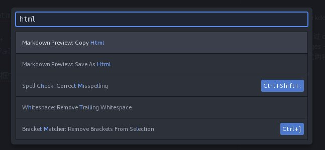

* atom写了markdown以后， 如何已html格式的预览

  * 可以通过 *ctrl* + *shift* + *P* 快捷键，
  * *Packages* --> *Command Palette* --> "Toggle"

  通过上述方式两种方式， 打开的对话框中，输入"html",   然后选择下面的*markdown Preview: Save As Html* 即可
  
  
