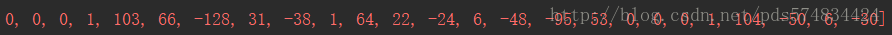
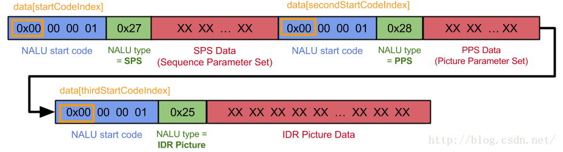

#### https://zhidao.baidu.com/question/536662507.html

视频编码是按“组”进行的， 每一组也叫一个GOP。
GOP和GOP之间是没有联系的， 编码关系只在GOP中间产生。
每一个GOP组都是从一个*关键帧*开始

*关键帧*是一幅完整的画面， GOP中间的那些帧都是不完整的， 需要由关键帧，前面的帧或者也包括后面的帧一起， 运算后得到。

关键帧也叫I帧（大写的i）， 它是帧间压缩编码里的重要帧。
帧间编码就是MPEG， H264那类

I帧的间隔调节会影响到GOP的长度。 进而影响到GOP的读取速度， 如果I帧间隔设置过大， 在必须要用到I帧的场合就可能用B/P帧来代替， 那样就是降低画面质量。
I帧是帧间压缩的基础的基础。比如一个典型的GOP（IBP帧包）结构一般IBBPBBPBBPBBPBBPBB
B是前后参考帧，即参考前面和后面两帧的数据加上本帧的变化而得出本帧的数据
P帧是向前参考帧。 解释参考B。
如果I帧损坏， 那么整个GOP结构就坏掉了。即IBBPBBPBBPBBPBBPBB这么多帧就一起坏掉。

#### https://www.cnblogs.com/zhangming-blog/articles/6000518.html
视频传输原理   
     视频是利用人眼视觉暂留的原理，通过播放一系列的图片，使人眼产生运动的感觉。单纯传输视频画面，视频量非常大，对现有的网络和存储来说是不可接受的。为了能够使视频便于传输和存储，人们发现视频有大量重复的信息，如果将重复信息在发送端去掉，在接收端恢复出来，这样就大大减少了视频数据的文件，因此有了H.264视频压缩标准。
  在H.264压缩标准中I帧、P帧、B帧用于表示传输的视频画面。

1、I帧
I帧又称帧内编码帧，是一种自带全部信息的独立帧，无需参考其他图像便可独立进行解码，可以简单理解为一张静态画面。视频序列中的第一个帧始终都是I帧，因为它是关键帧。

2、P帧
 P帧又称帧间预测编码帧，需要参考前面的I帧才能进行编码。表示的是当前帧画面与前一帧（前一帧可能是I帧也可能是P帧）的差别。解码时需要用之前缓存的画面叠加上本帧定义的差别，生成最终画面。与I帧相比，P帧通常占用更少的数据位，但不足是，由于P帧对前面的P和I参考帧有着复杂的依耐性，因此对传输错误非常敏感。

3、B帧
B帧又称双向预测编码帧，也就是B帧记录的是本帧与前后帧的差别。也就是说要解码B帧，不仅要取得之前的缓存画面，还要解码之后的画面，通过前后画面的与本帧数据的叠加取得最终的画面。B帧压缩率高，但是对解码性能要求较高。

总结：
I帧只需考虑本帧；P帧记录的是与前一帧的差别；B帧记录的是前一帧及后一帧的差别,能节约更多的空间,视频文件小了,但相对来说解码的时候就比较麻烦。因为在解码时,不仅要用之前缓存的画面,而且要知道下一个I或者P的画面,对于不支持B帧解码的播放器容易卡顿。

视频监控系统中预览的视频画面是实时的，对画面的流畅性要求较高。采用I帧、P帧进行视频传输可以提高网络的适应能力，且能降低解码成本所以现阶段的视频解码都只采用I帧和P帧进行传输。海康摄像机编码，I帧间隔是50，含49个P帧。

#### https://blog.csdn.net/heiheiya/article/details/81226833

#### http://www.cnblogs.com/skyofbitbit/p/3651270.html
体业务是网络的主要业务之间。尤其移动互联网业务的兴起，在运营商和应用开发商中，媒体业务份量极重，其中媒体的编解码服务涉及需求分析、应用开发、释放license收费等等。最近因为项目的关系，需要理清媒体的codec，比较搞的是，在豆丁网上看运营商的规范 标准，同一运营商同样的业务在不同文档中不同的要求，而且有些要求就我看来应当是历史的延续，也就是现在已经很少采用了。所以豆丁上看不出所以然，从 wiki上查。中文的wiki信息量有限，很短，而wiki的英文内容内多，删减版也减肥得太过。我在网上还看到一个山寨的中文wiki，长得很像，红色的，叫“天下维客”。wiki的中文还是很不错的，但是阅读后建议再阅读英文。

　　我对媒体codec做了一些整理和总结，资料来源于wiki，小部分来源于网络博客的收集。网友资料我们将给出来源。如果资料已经转手几趟就没办法，雁过留声，我们只能给出某个轨迹。

基本概念

编解码

　　编解码器（codec）指的是一个能够对一个信号或者一个数据流进行变换的设备或者程序。这里指的变换既包括将 信号或者数据流进行编码（通常是为了传输、存储或者加密）或者提取得到一个编码流的操作，也包括为了观察或者处理从这个编码流中恢复适合观察或操作的形式的操作。编解码器经常用在视频会议和流媒体等应用中。

容器

　　很多多媒体数据流需要同时包含音频数据和视频数据，这时通常会加入一些用于音频和视频数据同步的元数据，例如字幕。这三种数据流可能会被不同的程序，进程或者硬件处理，但是当它们传输或者存储的时候，这三种数据通常是被封装在一起的。通常这种封装是通过视频文件格 式来实现的，例如常见的*.mpg, *.avi, *.mov, *.mp4, *.rm, *.ogg or *.tta. 这些格式中有些只能使用某些编解码器，而更多可以以容器的方式使用各种编解码器。

　　FourCC全称Four-Character Codes，是由4个字符（4 bytes）组成，是一种独立标示视频数据流格式的四字节，在wav、avi档案之中会有一段FourCC来描述这个AVI档案，是利用何种codec来 编码的。因此wav、avi大量存在等于“IDP3”的FourCC。

　　视频是现在电脑中多媒体系统中的重要一环。为了适应储存视频的需要，人们设定了不同的视频文件格式来把视频和音频放在一个文件中，以方便同时回放。视频档实际上都是一个容器里面包裹着不同的轨道，使用的容器的格式关系到视频档的可扩展性。

### 规范
https://en.wikipedia.org/wiki/Audio_Video_Interleave

https://wenku.baidu.com/view/4f4f97e1c1c708a1284a4465.html H.264视频压缩标准
https://blog.csdn.net/xujaiwei/article/details/72425096 视频数据组织结构

https://blog.csdn.net/go_str/article/details/80340564 H264 解释

https://blog.csdn.net/pds574834424/article/details/78150474
H264是一种视频压缩标准。
根据不同类别，编码器会使用不同类型的帧，I帧、P帧和B帧。

(图出自H.264视频压缩标准白皮书)
I帧:自身可以通过视频解压算法解压成一张单独的完整的图片。P帧只需要参考前面的I帧或P帧，而B帧则需要同时参考前面和后面的I帧或P帧。
在H.264基准类中，仅使用I帧和P帧以实现低延时，因此是网络摄像机和视频编码器的理想选择。

H264有严格的规范，以00 00 00 01分割之后的下一个字节就是NALU类型，用来描述此帧的意义。
NALU类型:
（1）第1位禁止位，值为1表示语法出错
（2）第2~3位为参考级别
（3）第4~8为是nal单元类型
以通常的首帧来看：

https://blog.csdn.net/mandagod/article/details/51174480

https://blog.csdn.net/u010925568/article/details/75040492
H264码流中NALU sps pps IDR帧的理解
1、概念
什么是NALU？
H264码流可以分为两层，VCL层和NAL层，NAL的全称是Network abstraction layer,叫网络抽象层，它保存了H264相关的参数信息和图像信息，NAL层由多个单元NALU组成,NALU由了NALU头（00 00 00 01或者00 00 01）、sps(序列参数集)、pps(图像参数集合)、slice、sei、IDR帧、I帧（在图像运动变化较少时，I帧后面是7个P帧，如果图像运动变化大时，一个序列就短了，I帧后面可能是3个或者4个P帧）、P帧、B帧等数据。

sps、pps、I帧、P帧在NALU中的关系和nalu type判断
一个完整的NALU单元结构图如下：
这里写图片描述

- IDR帧和I帧的关系
IDR帧就是I帧，但是I帧不一定是IDR帧，在一个完整的视频流单元中第一个图像帧是IDR帧，IDR帧是强制刷新帧，在解码过程中，当出现了IDR帧时，要更新sps、pps，原因是防止前面I帧错误，导致sps，pps参考I帧导致无法纠正。
再普及一个概念是GOP，GOP的全称是Group of picture图像组，也就是两个I帧之间的距离，GOP值越大，那么I帧率之间P帧和B帧数量越多，图像画质越精细，如果GOP是120，如果分辨率是720P，帧率是60，那么两I帧的时间就是120/60=2s.
