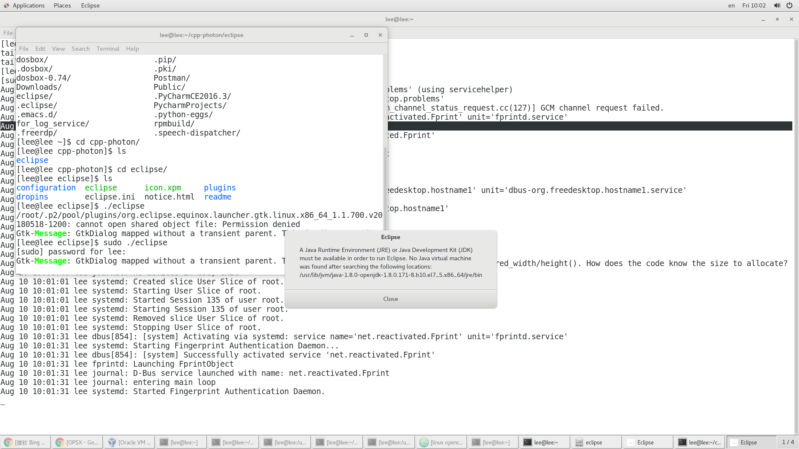

eclipse的无法启动跟netbeans是一样的， 都是因为我们升级了jdk.



解决：


修改安装目录下的*eclipse.ini*, 对于我的环境来说， 安装目录为*/home/lee/cpp-photon/eclipse*
```
[lee@lee eclipse]$ ls -l
total 228
drwxr-xr-x. 11 root root   4096 Aug  8 14:26 configuration
drwxr-xr-x.  2 root root      6 Aug  8 14:25 dropins
-rwxr-xr-x.  1 root root  73064 Jun 11 06:37 eclipse
-rw-r--r--.  1 root root    900 Aug  8 14:25 eclipse.ini
-rwxr-xr-x.  1 root root 140566 Jun 11 06:37 icon.xpm
-rw-r--r--.  1 root root   6297 Jun 17 05:08 notice.html
drwxr-xr-x.  2 root root     66 Aug  8 14:25 plugins
drwxr-xr-x.  2 root root     32 Aug  8 14:25 readme
[lee@lee eclipse]$ pwd
/home/lee/cpp-photon/eclipse

```

查看eclipse.ini, 修改-vm对应的配置项
```
-startup
plugins/org.eclipse.equinox.launcher_1.5.0.v20180512-1130.jar
--launcher.library
/root/.p2/pool/plugins/org.eclipse.equinox.launcher.gtk.linux.x86_64_1.1.700.v20180518-1200
-product
org.eclipse.epp.package.cpp.product
-showsplash
org.eclipse.epp.package.common
--launcher.defaultAction
openFile
--launcher.appendVmargs
-vm
/usr/lib/jvm/java-1.8.0-openjdk-1.8.0.171-8.b10.el7_5.x86_64/jre/bin
-vmargs
-Dosgi.requiredJavaVersion=1.8
-Dosgi.instance.area.default=@user.home/eclipse-workspace
-XX:+UseG1GC
-XX:+UseStringDeduplication
--add-modules=ALL-SYSTEM
-Dosgi.requiredJavaVersion=1.8
-Dosgi.dataAreaRequiresExplicitInit=true
-Xms256m
-Xmx1024m
--add-modules=ALL-SYSTEM
-Declipse.p2.max.threads=10
-Doomph.update.url=http://download.eclipse.org/oomph/updates/milestone/latest
-Doomph.redirection.index.redirection=index:/->http://git.eclipse.org/c/oomph/org.eclipse.oomph.git/plain/setups/

```

将
```
-vm
/usr/lib/jvm/java-1.8.0-openjdk-1.8.0.171-8.b10.el7_5.x86_64/jre/bin
```
改为
```
-vm
/usr/lib/jvm/java-1.8.0-openjdk-1.8.0.181-3.b13.el7_5.x86_64/jre/bin
```
即可
